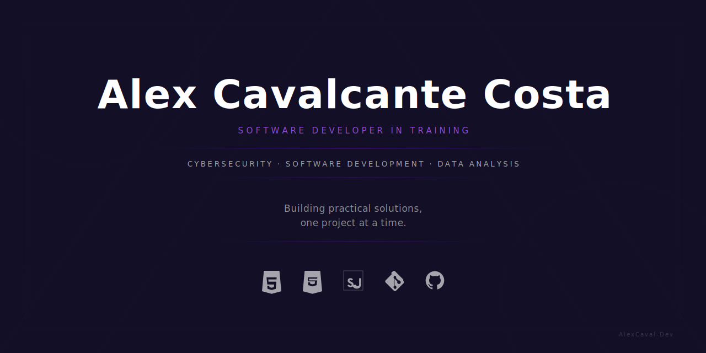

  

# Alex Cavalcante Costa

Systems Analysis and Development (ADS) student building real-world projects focused on Cybersecurity, Software Development and Data Analysis.

> Building practical solutions, one project at a time.

---

## Currently Working On

🛡 **SAFEHOOK** — Educational cybersecurity platform focused on security awareness, LGPD, phishing simulation and security maturity assessment.

🏛 **Hub Tributário** *(In Development)* — Internal platform designed to centralize access to state and municipal tax portals.

🌐 **Personal Portfolio** — Professional portfolio showcasing my projects, skills and journey in Software Development, Data Analysis and Cybersecurity.

---

## Tech Stack

---

## Currently Learning

---

## Featured Projects

### 🛡 SAFEHOOK
Educational cybersecurity platform focused on security awareness, LGPD, phishing simulation and security maturity assessment.

### 🌐 Personal Portfolio
Professional portfolio showcasing my projects, skills and journey in Software Development, Data Analysis and Cybersecurity.

---

## Contact

[LinkedIn](https://www.linkedin.com/in/alex-cavalcante-costa-276483197) · [Portfolio](https://alexcaval-portfolio.vercel.app) · [Email](mailto:alexcavalcante1800@gmail.com)
